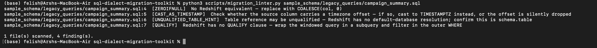

# SQL Dialect Migration Toolkit - Teradata → Amazon Redshift

A set of patterns, examples, and a linting script for migrating legacy Teradata SQL
codebases to Amazon Redshift. Built from lessons learned running a large scale
enterprise data warehouse migration, generalized here with a synthetic schema so the
patterns are reusable on any Teradata → Redshift project.

Teradata and Redshift are both MPP columnar databases, but they diverge in function
syntax, NULL handling, window-function semantics, and collation differences that
don't show up until a query silently returns wrong results in production. This repo
documents the recurring conversion patterns and ships a script that scans a `.sql`
codebase and flags lines likely to break on Redshift.



## What's inside

- **`examples/`** — before/after query pairs for each conversion pattern, with an
  explanation of *why* the Teradata version breaks on Redshift.
- **`scripts/migration_linter.py`** — scans a directory of `.sql` files and flags
  Teradata-specific syntax, printing the file, line number, pattern matched, and the
  suggested Redshift equivalent.
- **`sample_schema/`** — a small synthetic marketing-campaign schema (fake company,
  fake data) used to make the examples runnable and concrete.

## Conversion patterns covered

| Teradata | Redshift | Why it matters |
|---|---|---|
| `SUBSTR(col, start, len)` | `SUBSTRING(col FROM start FOR len)` | Redshift accepts `SUBSTR` but the standard-SQL form is safer across engines and avoids off-by-one confusion when porting |
| `ZEROIFNULL(col)` | `COALESCE(col, 0)` | Teradata-only function; no direct Redshift equivalent |
| `QUALIFY ROW_NUMBER() OVER (...) = 1` | Wrap the windowed query in a subquery and filter in the outer `WHERE` | Redshift has no `QUALIFY` clause |
| Comparing a `VARCHAR` from a case-sensitive source against a case-insensitive one | Add `COLLATE 'case_insensitive'` (or explicit `LOWER()` on both sides) | Redshift is case-sensitive by default; Teradata often isn't, so joins that matched in Teradata silently drop rows in Redshift |
| `CAST(col AS TIMESTAMP)` on a column carrying timezone offset data | `CAST(col AS TIMESTAMPTZ)` or explicit `AT TIME ZONE` conversion | Teradata's implicit timezone handling doesn't map 1:1; naive casts shift times silently |
| Table reference resolved by default database context | Fully-qualified `schema.table` reference | Teradata's default-database resolution doesn't exist in Redshift; unqualified names either fail or resolve to the wrong schema |

See `examples/` for full runnable before/after pairs of each.

## Using the linter

```bash
python scripts/migration_linter.py path/to/your/sql/directory
```

Outputs a report like:

```
legacy_queries/campaign_summary.sql:14  [QUALIFY]   Redshift has no QUALIFY clause — wrap in a subquery and filter in WHERE
legacy_queries/campaign_summary.sql:31  [ZEROIFNULL] No Redshift equivalent — replace with COALESCE(col, 0)
```

It's a static-analysis pass, not an auto-fixer so the point is to catch the ~80% of
issues that are mechanical before they surface as a production discrepancy, and leave
the judgment calls (collation, timezone semantics) for a human to resolve deliberately.

## Background

This pattern set came out of migrating a multi-terabyte Teradata marketing data
warehouse to Redshift, where these six issues accounted for the majority of
post-migration dashboard discrepancies. Root-causing each one meant tracing a wrong
number on a dashboard back through the ETL to a specific syntax mismatch — the linter
exists so that work only has to happen once per pattern, not once per query.

## License

MIT
